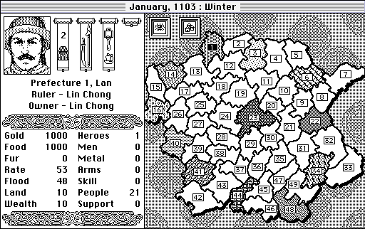

# Bandit Kings of Ancient China Scenario Toolkit

> **Try the example mod:** [`Dan's Custom Scenario`](https://github.com/danhealy/bandit_kings_modding/tree/main/examples/dans_custom_scenario) — a full rework of Scenario 2 that turns the 7 starting heroes and the 4 strongest NPCs into 11 new factions, activates every hero in the game, and parks a maxed-out Gao Qiu with 19 recruits in the center of the map. See the [scenario README](https://github.com/danhealy/bandit_kings_modding/tree/main/examples/dans_custom_scenario) for details and installation instructions.
>
> 

A small Ruby toolkit for editing scenarios and saved games in the [Macintosh version of **Bandit Kings of Ancient China**](https://macintoshgarden.org/games/bandit-kings-of-ancient-china), the classic 1989 Koei strategy game. Write short, readable scripts that say things like _"make hero 21 the ruler of prefecture 41"_ or _"give every prefecture a smithy and shipyard."_ The toolkit then reads your original game file, applies the changes, and writes out a new `.CIM` file you can drop into the game.

## What you can do with it

- **Inspect** any save or scenario file — see every hero, every prefecture, resources, allegiances, and status.
- **Create custom scenarios** by rearranging rulers, recruits, and unaligned heroes.
- **Edit stats** — strength, dexterity, wisdom, integrity, mercy, courage, body, loyalty, and more.
- **Move heroes** between prefectures, make them rulers, recruits, or townspeople.
- **Edit prefectures** — gold, food, metal, fur, flood, land, wealth, support, arms, skill, and facilities (shipyard/smithy).
- **Change the in-game date** — Give yourself another 10 years before the barbarians invade!
- **Build your own mods** with a small, friendly Ruby API.

## Quick start

1. **Put your original game file in this folder.**
   The easiest file to start with is the original `SUIDATA2.CIM` from the game's `Data` folder. You can also start with a saved game file. Copy it into this directory.

2. **Try analyzing the scenario or save.**
   Open a terminal in this directory and type:

   ```bash
   ruby analyze_save.rb SUIDATA2.CIM
   ```

   This will output all of the data for this scenario. To analyze your save file, just change `SUIDATA2.CIM` to your save filename.

3. **Try creating a custom scenario.**
   Open a terminal in this directory and type:

   ```bash
   ruby examples/dans_custom_scenario/dans_custom_scenario.rb
   ```

   Or write and run your own custom scenario script! See below for details.

   This produces a new file called `SUIDATA2_NEW.CIM` in the `examples/dans_custom_scenario/` directory.

4. **Back up and replace the original file.**
   Copy the new file over the original `SUIDATA2.CIM` in your vintage mac's `Data` folder. **Keep a backup of the original first.**

5. **Start the game and choose Scenario 2.**
   Your custom changes will be active.

## Inspecting a save or scenario file

Use `analyze_save.rb` to see what's inside any `.CIM` file (or save file) without changing it:

```bash
ruby analyze_save.rb SUIDATA2.CIM
```

To get spreadsheet-friendly CSV files instead:

```bash
ruby analyze_save.rb -c SUIDATA2.CIM
```

This writes two CSV files:

- `SUIDATA2_CIM_prefectures.csv``
- `SUIDATA2_CIM_heroes.csv`

## Installing Ruby

If the `ruby` command isn't found, install it first.

- **Windows:** Download the installer from <https://rubyinstaller.org/> and run it.
- **Mac:** Open a terminal and run:
  ```bash
  brew install ruby
  ```
  (If you don't have Homebrew, install it from <https://brew.sh/>.)
- **Linux:** Use your package manager, for example:
  ```bash
  sudo apt-get install ruby
  ```

Verify it worked with:

```bash
ruby --version
```

## About file types and FileTyper

Bandit Kings save and scenario files are raw binary files. For replacing scenarios, just ensure you use the naming convention `SUIDATAX.CIM` where X is the scenario number, and place the file in the `Data` folder, and the game will read it. However, for saved games on classic Mac OS, the game also cares about the **file type/creator codes** stored in the file system.

Once you upload your custom save to your Mac, you may need to set its file type to match an original Bandit Kings save file. [**FileTyper**](https://macintoshgarden.org/apps/filetyper-501) is a small utility that lets you change those codes. Open the original working save file with FileTyper, note the type and creator, then apply the same values to your generated save file.

## Making your own mods

The easiest way is to copy `examples/dans_custom_scenario/dans_custom_scenario.rb` or `examples/recreate_tests.rb` and change the `apply` method.

A minimal example looks like this:

```ruby
require_relative "lib/bandit_kings"

class MyMod < BanditKings::ScenarioScript
  def defaults
    { input: "SUIDATA2.CIM", output: "SUIDATA2_MOD.CIM" }
  end

  def apply(editor)
    # Give every prefecture a smithy and shipyard
    editor.add_all_facilities

    # Make hero 21 the ruler of prefecture 41
    editor.make_ruler(21, prefecture_id: 41)

    # Set the in-game date to August 1122
    editor.set_date(1122, 8)
  end
end

MyMod.run if __FILE__ == $PROGRAM_NAME
```

Run it the same way:

```bash
ruby my_mod.rb
```

Common helpers you can use inside `apply`:

| Method                                                      | What it does                                          |
| ----------------------------------------------------------- | ----------------------------------------------------- |
| `editor.activate_all_heroes(body: 100)`                     | Wake up every hero and set their body to 100.         |
| `editor.make_ruler(hero_id, prefecture_id: n)`              | Make a hero a ruler and install them in a prefecture. |
| `editor.make_recruit(hero_id, leader_id, loyalty: 100)`     | Make a hero a follower of another hero.               |
| `editor.make_town_person(hero_id, prefecture_id: n)`        | Make a hero unaligned and living in a prefecture.     |
| `editor.move_hero(hero_id, prefecture_id)`                  | Move a hero without changing their role.              |
| `editor.set_prefecture_resources(id, gold: ..., food: ...)` | Edit a prefecture's resources.                        |
| `editor.reset_prefecture(id)`                               | Clear a prefecture back to neutral defaults.          |
| `editor.add_all_facilities`                                 | Add a shipyard and smithy to every prefecture.        |
| `editor.set_date(year, month)`                              | Change the scenario date.                             |

## Project structure

```
lib/bandit_kings.rb            # Main entry point — require this.
lib/bandit_kings/structs.rb    # Binary data model for the game file.
lib/bandit_kings/parser.rb     # Reads and pretty-prints game files.
lib/bandit_kings/scenario_editor.rb  # Friendly high-level editing API.
lib/bandit_kings/scenario_script.rb  # Base class for writing mod scripts.
examples/                       # Example scripts to learn from.
analyze_save.rb                # Command-line inspector / CSV exporter.
```

## Safety tips

- **Always back up your original `.CIM` files** before replacing them.
- The toolkit validates that the output file is exactly the same size as the input (21,122 bytes), but it cannot guarantee the game will load every possible change. If the game crashes, restore your backup and make smaller edits. Sometimes crashes here can cause your game executable or Data folder to be corrupted, it's good practice to replace those files with fresh copies if you encounter a crash.
- The original `SUIDATA2.CIM` must be in this project directory (or you must pass the full path with `-i`).
